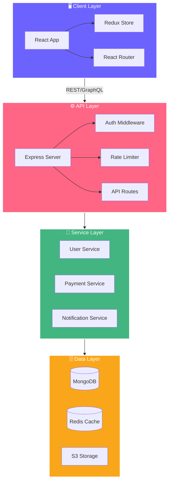
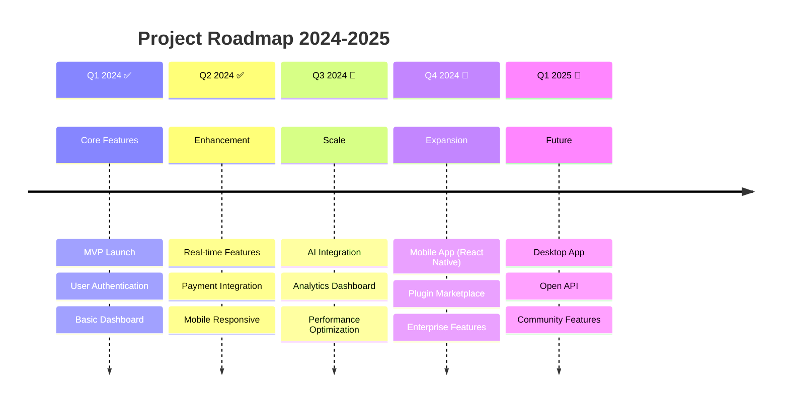

<!-- ========================================== -->
<!-- 🎨 ANIMATED HEADER SECTION -->
<!-- ========================================== -->

<div align="center">

<!-- Animated Typing Header -->
<a href="https://git.io/typing-svg"></a>

<!-- Animated Wave -->


<!-- Badges Row 1 - Status -->
<p>


</p>

<!-- Badges Row 2 - Tech -->
<p>


</p>

<!-- Badges Row 3 - Stats -->
<p>


</p>

<!-- Animated Separator -->


</div>

<!-- ========================================== -->
<!-- 📸 DEMO / PREVIEW SECTION -->
<!-- ========================================== -->

<div align="center">

## 🎬 Live Preview

<a href="https://your-demo-link.com">

</a>

<br/><br/>

<!-- Replace with your actual screenshot/GIF -->


<br/>

<!-- Project Screenshot Mockup -->
<picture>
  <source media="(prefers-color-scheme: dark)" srcset="https://placehold.co/900x500/1a1b27/6C63FF?text=🖥️+Your+App+Screenshot+Dark+Mode&font=montserrat">
  <source media="(prefers-color-scheme: light)" srcset="https://placehold.co/900x500/f5f5f5/6C63FF?text=🖥️+Your+App+Screenshot+Light+Mode&font=montserrat">
  
</picture>

</div>

<br/>

<!-- ========================================== -->
<!-- 📖 ABOUT SECTION -->
<!-- ========================================== -->

##  About The Project

<div align="center">
<table>
<tr>
<td>

**ProjectName** is a cutting-edge solution designed to revolutionize the way you work. Built with modern technologies and best practices, it delivers an exceptional user experience with blazing-fast performance.

🎯 **Problem:** Describe the problem your project solves

💡 **Solution:** Explain how your project addresses it

✨ **Impact:** Highlight the value it brings

</td>
</tr>
</table>
</div>

<!-- ========================================== -->
<!-- ✨ FEATURES SECTION -->
<!-- ========================================== -->

##  Features

<div align="center">

<!-- Feature Cards using HTML table -->
<table>
<tr>
<td align="center" width="25%">

### ⚡ Lightning Fast
Optimized for speed with lazy loading, code splitting, and efficient caching

</td>
<td align="center" width="25%">

### 🎨 Beautiful UI
Modern, responsive design with smooth animations and dark mode support

</td>
<td align="center" width="25%">

### 🔒 Secure
Enterprise-grade security with encryption, auth, and data protection

</td>
<td align="center" width="25%">

### 📱 Responsive
Pixel-perfect on all devices — mobile, tablet, and desktop

</td>
</tr>
<tr>
<td align="center" width="25%">

### 🧩 Modular
Plugin-based architecture for easy extensibility

</td>
<td align="center" width="25%">

### 🌍 i18n Ready
Multi-language support out of the box

</td>
<td align="center" width="25%">

### 📊 Analytics
Built-in analytics dashboard with real-time metrics

</td>
<td align="center" width="25%">

### 🚀 CI/CD
Automated testing and deployment pipeline

</td>
</tr>
</table>

</div>

<br/>

<details>
<summary><b>📋 Full Feature List (Click to expand)</b></summary>
<br/>

| Feature | Status | Description |
|---------|--------|-------------|
| ✅ User Authentication | `Complete` | OAuth 2.0, JWT, Social Login |
| ✅ Real-time Updates | `Complete` | WebSocket integration |
| ✅ Dark/Light Mode | `Complete` | System preference detection |
| ✅ API Rate Limiting | `Complete` | Redis-based throttling |
| 🔄 AI Integration | `In Progress` | GPT-4 powered features |
| 📅 Mobile App | `Planned` | React Native version |
| 📅 Desktop App | `Planned` | Electron wrapper |

</details>

<!-- Animated Separator -->


<!-- ========================================== -->
<!-- 🛠️ TECH STACK SECTION -->
<!-- ========================================== -->

##  Tech Stack

<div align="center">

### 🖥️ Frontend
<p>

</p>

### ⚙️ Backend
<p>

</p>

### 🗄️ Database & Cloud
<p>

</p>

### 🧰 Tools & Others
<p>

</p>

</div>

<!-- ========================================== -->
<!-- 📐 ARCHITECTURE SECTION -->
<!-- ========================================== -->

## 🏗️ Architecture



<!-- ========================================== -->
<!-- 🚀 GETTING STARTED SECTION -->
<!-- ========================================== -->

##  Getting Started

### 📋 Prerequisites

Before you begin, ensure you have the following installed:

| Tool | Version | Installation |
|------|---------|-------------|
|  | `>= 18.0` | [Download](https://nodejs.org/) |
|  | `>= 9.0` | Comes with Node.js |
|  | `latest` | [Download](https://git-scm.com/) |
|  | `>= 6.0` | [Download](https://www.mongodb.com/) |

### ⚡ Quick Start

<details>
<summary><b>🐳 Option 1: Docker (Recommended)</b></summary>
<br/>

```bash
# Clone the repository
git clone https://github.com/yourusername/yourrepo.git

# Navigate to project directory
cd yourrepo

# Start with Docker Compose
docker-compose up -d

# 🎉 App is running at http://localhost:3000
```

</details>

<details>
<summary><b>💻 Option 2: Manual Installation</b></summary>
<br/>

```bash
# 1️⃣ Clone the repository
git clone https://github.com/yourusername/yourrepo.git

# 2️⃣ Navigate to project directory
cd yourrepo

# 3️⃣ Install dependencies
npm install

# 4️⃣ Set up environment variables
cp .env.example .env

# 5️⃣ Configure your .env file
nano .env
```

```env
# ⚙️ Environment Configuration
# ================================

# 🌐 Server
PORT=3000
NODE_ENV=development

# 🗄️ Database
DATABASE_URL=mongodb://localhost:27017/projectname
REDIS_URL=redis://localhost:6379

# 🔐 Authentication
JWT_SECRET=your-super-secret-key-here
JWT_EXPIRE=7d

# 📧 Email (Optional)
SMTP_HOST=smtp.gmail.com
SMTP_PORT=587
SMTP_USER=your-email@gmail.com
SMTP_PASS=your-app-password

# 🔑 API Keys (Optional)
STRIPE_SECRET_KEY=sk_test_xxx
AWS_ACCESS_KEY=xxx
```

```bash
# 6️⃣ Run database migrations/seeds
npm run db:setup

# 7️⃣ Start the development server
npm run dev

# 🎉 App is running at http://localhost:3000
```

</details>

<br/>

### 🧪 Running Tests

```bash
# Run all tests
npm test

# Run tests with coverage
npm run test:coverage

# Run tests in watch mode
npm run test:watch

# Run E2E tests
npm run test:e2e
```

<!-- ========================================== -->
<!-- 📁 PROJECT STRUCTURE SECTION -->
<!-- ========================================== -->

## 📁 Project Structure

```
📦 ProjectName
├── 📂 .github
│   ├── 📂 workflows        # CI/CD pipelines
│   └── 📂 ISSUE_TEMPLATE   # Issue templates
├── 📂 public               # Static assets
├── 📂 src
│   ├── 📂 assets            # Images, fonts, icons
│   ├── 📂 components        # Reusable UI components
│   │   ├── 📂 common        # Buttons, Inputs, Modals
│   │   ├── 📂 layout        # Header, Footer, Sidebar
│   │   └── 📂 features      # Feature-specific components
│   ├── 📂 hooks             # Custom React hooks
│   ├── 📂 pages             # Page components / routes
│   ├── 📂 services          # API service layer
│   ├── 📂 store             # State management (Redux)
│   ├── 📂 styles            # Global styles & themes
│   ├── 📂 types             # TypeScript type definitions
│   ├── 📂 utils             # Helper functions
│   ├── 📄 App.tsx           # Root component
│   └── 📄 main.tsx          # Entry point
├── 📂 server
│   ├── 📂 controllers      # Route controllers
│   ├── 📂 middleware        # Express middleware
│   ├── 📂 models            # Database models
│   ├── 📂 routes            # API routes
│   ├── 📂 services          # Business logic
│   └── 📄 index.ts          # Server entry point
├── 📂 tests                 # Test files
├── 📄 .env.example          # Environment template
├── 📄 docker-compose.yml    # Docker configuration
├── 📄 package.json          # Dependencies
├── 📄 tsconfig.json         # TypeScript config
└── 📄 README.md             # You are here! 📍
```

<!-- Animated Separator -->


<!-- ========================================== -->
<!-- 📊 STATS & METRICS SECTION -->
<!-- ========================================== -->

## 📊 Project Stats

<div align="center">

<!-- GitHub Stats Cards -->


<br/><br/>

<!-- Activity Graph -->


</div>

<!-- ========================================== -->
<!-- 🗺️ ROADMAP SECTION -->
<!-- ========================================== -->

## 🗺️ Roadmap

<div align="center">



</div>

<br/>

- [x] ~~Phase 1: Core Platform~~ ✅
- [x] ~~Phase 2: User Management~~ ✅
- [x] ~~Phase 3: Payment Integration~~ ✅
- [ ] Phase 4: AI-Powered Features 🔄
- [ ] Phase 5: Mobile Application 📅
- [ ] Phase 6: Enterprise Edition 📅

<!-- ========================================== -->
<!-- 🤝 CONTRIBUTING SECTION -->
<!-- ========================================== -->

##  Contributing

<div align="center">

**We love contributions!** 🎉

Every contribution, no matter how small, is valued and appreciated.

</div>

<br/>

<details>
<summary><b>📝 Contribution Guidelines</b></summary>
<br/>

1. **🍴 Fork** the repository
2. **🌿 Create** your feature branch
   ```bash
   git checkout -b feature/AmazingFeature
   ```
3. **💻 Code** your amazing feature
4. **✅ Test** your changes
   ```bash
   npm test
   ```
5. **📝 Commit** your changes
   ```bash
   git commit -m '✨ feat: Add AmazingFeature'
   ```
6. **📤 Push** to the branch
   ```bash
   git push origin feature/AmazingFeature
   ```
7. **🔃 Open** a Pull Request

</details>

### 📝 Commit Convention

We use [Conventional Commits](https://www.conventionalcommits.org/):

| Type | Emoji | Description |
|------|-------|-------------|
| `feat` | ✨ | New feature |
| `fix` | 🐛 | Bug fix |
| `docs` | 📝 | Documentation |
| `style` | 💄 | Styling changes |
| `refactor` | ♻️ | Code refactoring |
| `perf` | ⚡ | Performance improvement |
| `test` | ✅ | Tests |
| `ci` | 👷 | CI/CD changes |
| `chore` | 🔧 | Maintenance |

<!-- ========================================== -->
<!-- 👥 TEAM / CONTRIBUTORS SECTION -->
<!-- ========================================== -->

## 👥 Contributors

<div align="center">

**Thanks to these amazing people!** 💜

<a href="https://github.com/yourusername/yourrepo/graphs/contributors">
  
</a>

<br/><br/>

<!-- Team Members -->
<table>
<tr>
<td align="center">
<a href="https://github.com/yourusername">

<br/>
<sub><b>Your Name</b></sub>
</a>
<br/>
<sub>🏗️ Creator & Lead</sub>
</td>
<td align="center">
<a href="https://github.com/contributor1">

<br/>
<sub><b>Contributor 1</b></sub>
</a>
<br/>
<sub>💻 Core Dev</sub>
</td>
<td align="center">
<a href="https://github.com/contributor2">

<br/>
<sub><b>Contributor 2</b></sub>
</a>
<br/>
<sub>🎨 UI/UX</sub>
</td>
<td align="center">
<a href="https://github.com/contributor3">

<br/>
<sub><b>Contributor 3</b></sub>
</a>
<br/>
<sub>📝 Docs</sub>
</td>
</tr>
</table>

</div>

<!-- ========================================== -->
<!-- 💬 SUPPORT SECTION -->
<!-- ========================================== -->

## 💬 Support & Community

<div align="center">

<a href="https://discord.gg/your-server"></a>
<a href="https://twitter.com/yourusername"></a>
<a href="https://www.youtube.com/@yourchannel"></a>
<a href="https://dev.to/yourusername"></a>
<a href="mailto:your-email@gmail.com"></a>

<br/><br/>

<table>
<tr>
<td>

💡 **Got a question?** → [Start a Discussion](https://github.com/yourusername/yourrepo/discussions)

🐛 **Found a bug?** → [Report an Issue](https://github.com/yourusername/yourrepo/issues)

✨ **Have an idea?** → [Request a Feature](https://github.com/yourusername/yourrepo/issues/new?template=feature_request.md)

⭐ **Like this project?** → Give it a star!

</td>
</tr>
</table>

</div>

<!-- ========================================== -->
<!-- 📜 LICENSE SECTION -->
<!-- ========================================== -->

## 📜 License

<div align="center">

Distributed under the **MIT License**.

See [`LICENSE`](LICENSE) for more information.

```
MIT License

Copyright (c) 2024 Your Name

Permission is hereby granted, free of charge, to any person obtaining a copy
of this software and associated documentation files (the "Software"), to deal
in the Software without restriction, including without limitation the rights
to use, copy, modify, merge, publish, distribute, sublicense, and/or sell
copies of the Software...
```

</div>

<!-- ========================================== -->
<!-- ⭐ STAR HISTORY SECTION -->
<!-- ========================================== -->

## ⭐ Star History

<div align="center">

<a href="https://star-history.com/#yourusername/yourrepo&Date">
  <picture>
    <source media="(prefers-color-scheme: dark)" srcset="https://api.star-history.com/svg?repos=yourusername/yourrepo&type=Date&theme=dark" />
    <source media="(prefers-color-scheme: light)" srcset="https://api.star-history.com/svg?repos=yourusername/yourrepo&type=Date" />
    
  </picture>
</a>

</div>

<!-- ========================================== -->
<!-- 🙏 ACKNOWLEDGMENTS SECTION -->
<!-- ========================================== -->

## 🙏 Acknowledgments

<div align="center">

| Resource | Description |
|----------|-------------|
| [React](https://reactjs.org/) | Frontend library |
| [Tailwind CSS](https://tailwindcss.com/) | Utility-first CSS |
| [Shields.io](https://shields.io/) | Badges |
| [Skill Icons](https://skillicons.dev/) | Tech stack icons |
| [Readme Typing SVG](https://github.com/DenverCoder1/readme-typing-svg) | Typing animation |
| [Capsule Render](https://github.com/kyechan99/capsule-render) | Header/footer |
| [GitHub Readme Stats](https://github.com/anuraghazra/github-readme-stats) | Stats cards |
| [Contrib.rocks](https://contrib.rocks/) | Contributor avatars |

</div>

<!-- ========================================== -->
<!-- 📞 FOOTER SECTION -->
<!-- ========================================== -->

<br/>


<div align="center">

### 💜 If this project helped you, please consider giving it a ⭐

<br/>

**Made with ❤️ and lots of ☕ by [Your Name](https://github.com/yourusername)**

<br/>

<a href="#top">

</a>

</div>

<!-- 
===========================================
🎨 CUSTOMIZATION TIPS:
===========================================

1. Replace "yourusername/yourrepo" with your actual GitHub info
2. Replace "ProjectName" with your project name
3. Update tech stack badges to match your project
4. Add real screenshots/GIFs of your project
5. Update the .env variables for your project
6. Customize the color scheme (currently using #6C63FF purple)
7. Update social media links
8. Add/remove sections as needed

🎨 COLOR REFERENCE:
- Primary: #6C63FF (Purple)
- Accent: #FF6584 (Pink)
- Success: #43B581 (Green)
- Warning: #FAA61A (Orange)
- Background: #1a1b27 (Dark)

🔗 USEFUL BADGE GENERATORS:
- https://shields.io/
- https://badgen.net/
- https://forthebadge.com/
- https://img.shields.io/

🖼️ ANIMATED ELEMENTS USED:
- Typing SVG animation (header)
- Capsule render (header/footer waves)
- Rainbow line separator
- Snake contribution grid
- Giphy animated emojis
- Mermaid diagrams
- Star history chart
===========================================
-->
```

---

## 🎯 What's Included

| Element | Description |
|---------|-------------|
| 🌊 **Animated Wave Header/Footer** | Gradient wave animations using Capsule Render |
| ⌨️ **Typing Animation** | Auto-typing text in the header |
| 🐍 **Snake Animation** | GitHub contribution grid snake |
| 📊 **Mermaid Diagrams** | Architecture & timeline charts |
| 🏷️ **Custom Badges** | Styled badges for tech stack, status, stats |
| 🌗 **Dark/Light Mode** | Adapts to user's theme preference |
| 🎭 **Animated GIF Emojis** | Moving emojis for section headers |
| 📈 **GitHub Stats** | Auto-updating stats cards |
| ⭐ **Star History** | Interactive star growth chart |
| 🌈 **Rainbow Separators** | Animated line dividers |
| 📁 **Tree Structure** | Visual project structure |
| 🎨 **Feature Cards** | Table-based feature grid |

## ✏️ To customize it:

1. **Replace** all `yourusername/yourrepo` with your actual GitHub details
2. **Replace** `ProjectName` with your project name
3. **Update** tech stack icons to match your project
4. **Add** real screenshots/GIFs
5. **Modify** the color scheme (search for `#6C63FF`)
6. **Remove** sections you don't need
